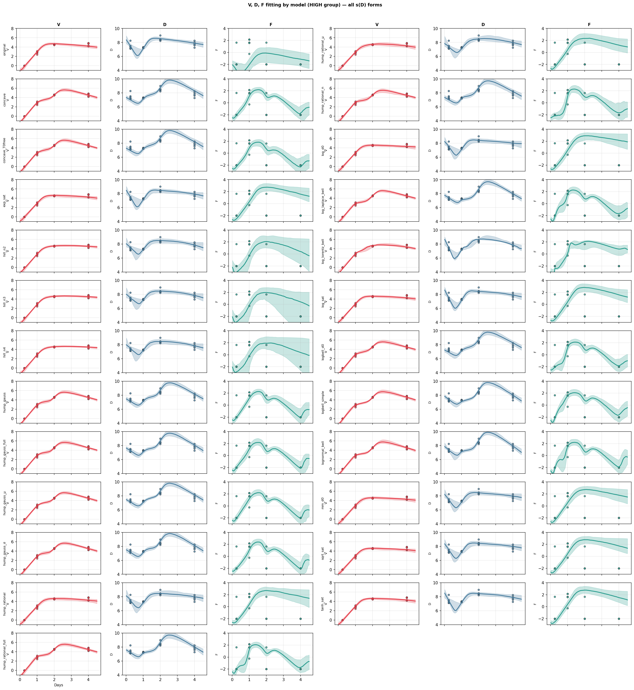

# V, D, F Fitting by s(D) Functional Form — HIGH Group

**stan_14 TIVFD Model Comparison**

---

## Overview

Figure 1 shows the posterior predictive fits for viral load (V), defective interfering particle level (D), and interferon (F) across all s(D) functional forms fitted to the HIGH group data. The underlying model is the TIVFD ODE system:

$$
\frac{dT}{dt} = -\beta T V
$$
$$
\frac{dI}{dt} = \beta T V - \delta I
$$
$$
\frac{dV}{dt} = (1-d)\, p_{\text{eff}}\, I - c V, \quad p_{\text{eff}} = \frac{\hat{p}}{1 + \epsilon_2 F}
$$
$$
\frac{dD}{dt} = d\, p_{\text{eff}}\, I - h D
$$
$$
\frac{dF}{dt} = s(D)\, I - \alpha F
$$

where $T$ = target cells, $I$ = infected cells, $V$ = virus, $D$ = DIPs (defective interfering particles), and $F$ = IFN. The only component we vary across models is $s(D)$, the DIP-enhanced IFN production rate. All other parameters ($\beta$, $\delta$, $\hat{p}$, $\epsilon_2$, $c$, $d$, $h$, $\alpha$, and initial conditions $V_0$, $D_0$, $F_0$) are shared or have analogous priors.

**Good fits** (e.g., hump_gauss, lognormal_bell, hump_rational_full, logbell_simple) show narrow credible intervals that track the data for V, D, and F. They typically have low RMSE on F (the hardest variable), reasonable R-hat (≈ 1.00–1.01), and adequate ESS. These hump-shaped s(D) forms capture the observed F peak at intermediate times and the subsequent decline, consistent with an optimal DIP level for IFN induction.

**Bad or problematic fits** include: (i) monotone saturating forms (original, mm_d0, tanh_sat, exp_sat, log_sat, sqrt_sat) that fail to fit F (RMSE$_F$ > 2.5); they cannot produce the F hump because s(D) only increases with D. (ii) Models with multiple peaks or overly flexible F dynamics (e.g., hump_gauss_full) may overfit when data are sparse; the data show a single F peak, so extra flexibility risks overfitting. (iii) Models with poor diagnostics: lognormal_bell has high treedepth hits (79%) and divergences (3.5%), and some parameters with R-hat > 1.01, suggesting incomplete mixing. (iv) Hill models (hill_n2, hill_n3, hill_n4) fit D very well (low RMSE$_D$) but F poorly (RMSE$_F$ ≈ 2.3–2.4); the monotone Hill form cannot reproduce the F hump. (v) Overfitting: if a model fits V, D, and F almost perfectly with very narrow intervals, it may be overparameterized relative to the data; LOO and $p_{\text{loo}}$ help guard against this.

---

## Figure

**Figure 1.** V, D, F fitting by model (HIGH group) — all s(D) forms. Each row is one s(D) functional form; columns show V (red), D (blue), and F (teal). Grey points = data; solid lines = posterior median; shaded = 95% credible interval.

---

## Model Comparison Table

| s(D) formula | Priors (bounds, SD) | Posteriors [95% CI] | Comments |
|--------------|---------------------|---------------------|----------|
| $s_0 + s_d D/(1+\theta_s D)$ | $\beta\in[10^{-8},10^{-3}]$, $\delta\in[0.2,8]$, $p_{\hat{}}\in[0.1,10^3]$, $\epsilon_2\in[10^{-4},10]$, $c\in[2,12]$, $h\in[2,15]$, $s_0\in[10^{-4},1]$, $s_d\in[10^{-4},20]$, $\theta_s\in[1,10^5]$, $\alpha\in[1,15]$; log-scale $\mathcal{N}$(mid, 2–3.5) | $s_d$: [0.02, 0.36]; $\theta_s$: wide | **Bad F fit**. RMSE$_V$=0.25, RMSE$_D$=0.10, RMSE$_F$=2.11. Monotone s(D) cannot produce F hump. |
| $s_0 + s_d (D/D_0)\exp(1-D/D_0)$ (concave) | Same common priors; $D_0$ = IC | $s_d$: [0.06, 1.40] (concave_T0free) | **Good F**. RMSE$_F$=1.15–1.23. Peak at $D=D_0$. R-hat ≈ 1.00. |
| $s_0 + s_d (1-e^{-D/D_0})$ (exp_sat) | Same | — | **Bad F**. RMSE$_F$=2.82. Saturating form. |
| $s_0 + s_d \tanh(D/D_0)$ (tanh_sat) | Same | — | **Bad F**. RMSE$_F$=2.85. |
| $s_0 + s_d \sqrt{D/(D_0+D)}$ (sqrt_sat) | Same | — | **Bad F**. RMSE$_F$=2.85. |
| $s_0 + s_d \exp(-\frac{1}{2}(D/D_0-1)^2)$ (hump_gauss) | Same; $\sigma_g$, $\mu_g$ N/A | $s_d$: [0.02, 0.36]; $D_0$: [845, 2784]; $\alpha$: [7.6, 14.7] | **Good**. RMSE$_V$=0.15, RMSE$_D$=0.30, RMSE$_F$=1.23. R-hat ≈ 1.00; 1 div, 14% treedepth. Peak fixed at $D=D_0$. |
| $s_0 + s_d \exp(-(D/D_0-1)^2/(2\sigma_g^2))$ (hump_gauss_$\sigma$) | + $\sigma_g\in[0.1,10]$ | — | **Good**. RMSE$_F$=1.22. Free width. Risk of overfitting if $\sigma_g$ unconstrained. |
| $s_0 + s_d \exp(-\frac{1}{2}(D/D_0-\mu_g)^2)$ (hump_gauss_$\mu$) | + $\mu_g\in[0.1,5]$ | — | **Good**. RMSE$_F$=1.20. Free peak location. |
| $s_0 + s_d \exp(-(D/D_0-\mu_g)^2/(2\sigma_g^2))$ (hump_gauss_full) | + $\mu_g$, $\sigma_g$ | — | **Best LOO** among flexible. RMSE$_F$=1.12. 4 params for s(D). May overfit; no multi-peak info in data. |
| $s_0 + s_d x/(1+x^2)$, $x=D/D_0$ (hump_rational) | Same | — | **Bad F**. RMSE$_F$=2.82. Simple hump but F fit poor vs Gaussian. |
| $s_0 + s_d x^{n_r}/(1+x^{2n_r})$ (hump_rational_n) | + $n_r\in[0.2,5]$ | — | **Good F**. RMSE$_F$=1.24. $n_r$ sharpens peak. LOO warning. |
| $s_0 + s_d z^{n_r}/(1+z^{2n_r})$, $z=D/(\mu_r D_0)$ (hump_rational_full) | + $n_r$, $\mu_r$ | — | **Good**. RMSE$_F$=1.09. 3rd best LOO. |
| $s_0 + s_d \exp(-(\ln D - \ln D_{\text{pk}})^2/(2w^2))$ (lognormal_bell) | + $D_{\text{pk}}\in[1,10^8]$, $\sigma_{\log}\in[0.1,10]$ | $s_d$: [0.06, 1.40]; $D_{\text{pk}}$: [307, 1130]; $\sigma_{\log}$: [0.31, 0.78] | **Best LOO** but **poor diagnostics**: 79% treedepth, 3.5% div, R-hat > 1.01 for $\beta$, $p_{\hat{}}$, $c$, $h$, $s_d$, $D_0$. Use with caution. |
| $s_0 + s_d \exp(-|\ln(D/D_{\text{pk}})|/w)$ (log_laplace_bell) | + $D_{\text{pk}}$, $w$ | — | **Good**. RMSE$_V$=0.12, RMSE$_F$=1.18. |
| $s_0 + s_d \exp(-(\ln(D/D^*))^2)$ (logbell_simple) | + $D^*$ | — | **Good**. RMSE$_V$=0.11, RMSE$_F$=1.16. 3rd LOO. |
| $s_d D^n/(\theta_s^n + D^n)$ (hill_n2, n3, n4) | No $s_0$; $\theta_s\in[1,10^5]$, $s_d\in[10^{-4},20]$; Hill-specific bounds | $s_d$: [0.0003, 0.033] (n2); $\theta_s$: [11, 15969] (n2) | **Excellent D**, **bad F**. RMSE$_D$=0.04–0.06, RMSE$_F$=2.28–2.37. Monotone Hill cannot fit F hump. 2 s(D) params. R-hat ≈ 1.00. |

---

## Summary

Hump-shaped s(D) forms (Gaussian, lognormal bell, rational with $n_r$) consistently outperform monotone saturating and Hill forms for fitting F, which exhibits a peak at intermediate times. The best LOO models are lognormal_bell, hump_gauss_full, and logbell_simple, but lognormal_bell has concerning MCMC diagnostics. For robustness, hump_gauss (fixed peak at $D_0$) or hump_rational_full offer a good balance of fit quality and parsimony. Hill models are useful when D fitting is the priority but should not be used when F dynamics are of interest.
